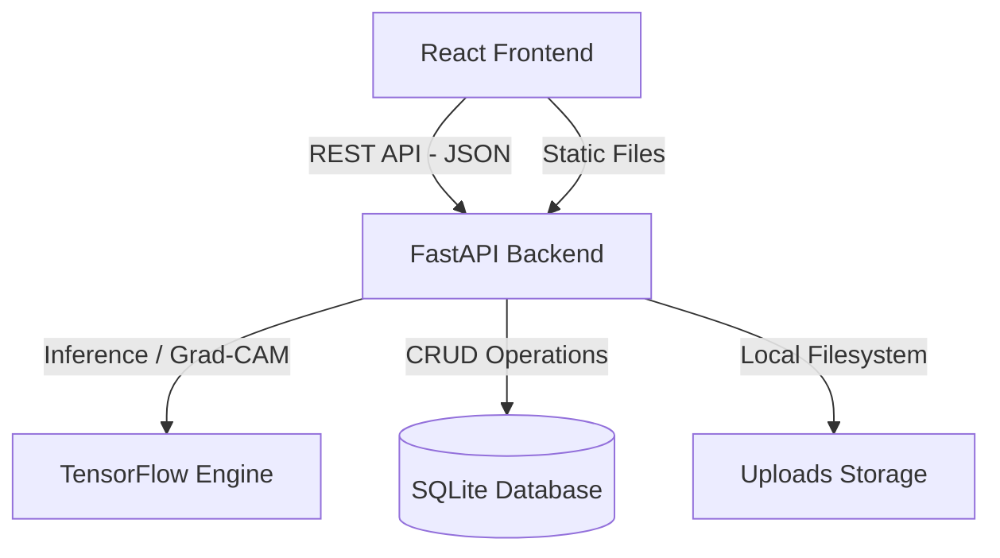

# System Architecture Document — BrainTumorAI

This document outlines the architectural details of the BrainTumorAI system.

---

## 1. System Topology Overview

The system is decoupled into three primary tiers:
1. **Frontend Presentation**: Single Page Application built on React, TypeScript, Vite, and Tailwind CSS.
2. **Backend API Gateway**: Asynchronous FastAPI service handling business logic, user auth, prediction records, reporting, and file storage coordination.
3. **ML Inference Tier**: TensorFlow engine running inside the FastAPI process, loading model checkpoints dynamically, and executing Grad-CAM calculations.

---

## 2. Component Design

### 2.1 Database Schema
The database layer uses SQLite with SQLAlchemy ORM.
- **User Table**:
  - `id` (PK, Integer)
  - `email` (Unique, String)
  - `username` (Unique, String)
  - `hashed_password` (String)
  - `role` (String: 'user' | 'admin')
  - `created_at` (DateTime)
- **Prediction Table**:
  - `id` (PK, Integer)
  - `user_id` (FK to User, Integer)
  - `original_filename` (String)
  - `image_path` (String)
  - `predicted_class` (String)
  - `confidence` (Float)
  - `probabilities_json` (Text)
  - `gradcam_path` (String, Nullable)
  - `processing_time_ms` (Float)
  - `model_version` (String)
  - `created_at` (DateTime)

### 2.2 Storage Abstraction
- A storage utility validates uploaded images (extension check, mimetype check, size limit < 10MB).
- Files are saved locally to `uploads/mri/` and `uploads/gradcam/`.
- Paths are resolved relatively, allowing easy transition to S3 or GCP Cloud Storage.

### 2.3 JWT Authentication
- Uses `python-jose` for JWT sign/verify.
- Route security uses standard FastAPI dependency injection (`Depends(get_current_user)`).
